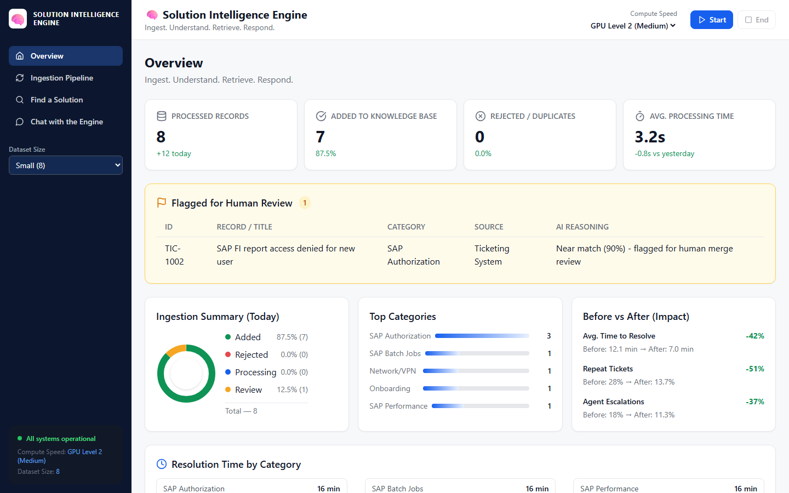

[](https://www.python.org/downloads/)
[](https://github.com/astral-sh/ruff)
[](LICENSE)

# Solution Intelligence Engine

An AI-powered enterprise knowledge engine that connects ticketing, SAP,
SharePoint, and knowledge-base systems into one **searchable solution index**.
It ingests support records, grades them for quality, catches duplicates, and
retrieves proven fixes for new issues — with a transparent, trust-first
"why" panel and a **trilingual** (English / Bahasa Malaysia / Chinese) retrieval
model. Ships with a full Python backend, a React dashboard, and a runnable
demo dataset.

[](https://youtu.be/EL6kNAdEPOY)
(click to watch the demo video!)



## Highlights

- **Multi-stage ingestion pipeline** — every record passes a structural
  filter, an AI quality judge, and an embedding-based duplicate check
  before it is accepted, flagged for human review, or rejected.
- **Semantic retrieval with confidence** — matches a new issue against
  proven solutions using multilingual embeddings, then blends similarity with
  historical success rate, exact error-code/module/environment matches,
  recency, and consultant feedback into a deterministic 0–100% confidence
  score — weighted, auditable, and explainable.
- **Trust-first "why" panel** — each answer shows its source system,
  similarity scores, confidence, and prior success, so no decision is a
  black box.
- **Conversational refinement** — a chat agent re-ranks candidates from
  follow-up questions without calling an external model.
- **Human-in-the-loop** — near-duplicates are flagged for human review with
  the AI's reasoning attached instead of silently auto-committed.
- **Trilingual out of the box** — a single English query surfaces matching
  records in English, Bahasa Malaysia, and Chinese.

## Tech Stack

| Layer | Technology |
| --- | --- |
| Backend | Python 3.11+, FastAPI, Pydantic, uv |
| Embeddings & retrieval | sentence-transformers (multilingual), cosine similarity |
| Frontend | React 18, TypeScript, Vite, Tailwind CSS, Zustand, TanStack Query |
| Quality tooling | Ruff, Pyright, pytest, Vitest, Playwright, pre-commit |
| Docs | MkDocs (Diátaxis) |
| Packaging | uv + `src`-layout package, npm workspaces |

## Architecture

```
              ┌──────────────┐   ┌──────────┐   ┌──────────────┐   ┌──────────┐
              │  Ticket      │   │  SAP     │   │  SharePoint  │   │   KB     │
              │  Connector   │   │  Notes   │   │  Documents   │   │ Articles │
              └──────┬───────┘   └────┬─────┘   └──────┬───────┘   └────┬─────┘
                     └────────────────┴────────────────┴────────────────┘
                                              │
                                              ▼
                                  ┌─────────────────────────┐
                                  │        Ingenño          │
                                  │  Stage 1 · structural   │
                                  │  AI Judge · quality     │
                                  │  Duplicate · similarity │
                                  └──────────┬──────────────┘
                                             │
                        ┌────────────────────┼────────────────────┐
                        ▼                    ▼                    ▼
                    Accepted             Flagged for          Rejected
                    ─────────            human review        (duplicates,
                    added to             (near-duplicates,    low quality)
                    knowledge index      never auto-applied)
                        │
                        ▼
               ┌──────────────────────────────────────────┐
               │  KnowledgeIndex  ·  embeddings + cosine  │
               │  ConfidenceScorer · 7 weighted signals    │
               │  ConversationalAgent · chat refinement   │
               └──────────────────────────────────────────┘
                        │
                        ▼
              FastAPI  /api/search  /api/chat  /api/analytics
                        │
                        ▼
              React dashboard (Overview · Pipeline · Find · Chat)
```

## Getting Started

### Installation

```bash
git clone https://github.com/OctakoPy/ai-solution-intelligence-engine
cd ai-solution-intelligence-engine
uv sync --all-groups   # Python environment (backend + tests + docs)
npm install            # Node environment (frontend)
```

You need [uv](https://docs.astral.sh/uv/getting-started/installation/) and
Node.js ≥ 20.

### Run the app

```bash
just dev               # FastAPI on :8004 + Vite dev server on :5179
```

Open <http://localhost:5179>. The Vite dev server proxies `/api` to the
backend automatically. (No `just`? Use `scripts/run-dev.sh` / `scripts/run-dev.bat`.)

- Overview — KPIs, flagged-for-review queue, impact, resolution time
- Pipeline — live, animation of records flowing through Stage 1 → judge → duplicate
- Find a Solution — semantic search with confidence + expandable solutions
- Chat — conversational retrieval with sourced answers

Without a frontend, the API is available at <http://localhost:8004/docs>.

### Python quickstart

```python
from solution_intelligence.service import SolutionEngine
from solution_intelligence.sources import load_filtered

engine = SolutionEngine()
engine.ingest(load_filtered(max_total=12))

for hit in engine.search("SAP FI report access denied authorization error", top_k=3):
    print(hit.entry.title, f"{hit.combined_score:.0%}")
```

## Demo dataset

A bundled synthetic dataset (`data/knowledge.json`, 78 records) simulates the
four enterprise source systems:

| Source | IDs | Records |
| --- | --- | --- |
| Ticket | `TIC-*` | 59 |
| SAP note | `SAP-*` | 8 |
| SharePoint doc | `SHA-*` | 6 |
| Knowledge-base article | `KB_-*` | 5 |

72 records are English; 3 are Bahasa Malaysia and 3 are Chinese (with
stored English translations) to exercise cross-lingual retrieval.

**Try the context panel:** on **Find a Solution**, expand **Incident details
(optional)** and enter an error code, system, and environment. The engine
matches them against the knowledge base and shows exactly which cues matched
(e.g. `M8149` + `SAP MM` + `PROD` → `TIC-3011`, while the same error code in
`UAT` → a different root cause, `TIC-3012`). See the
[demo script](docs/tutorials/demo-script.md) for the full walkthrough.

The full demo script with sample queries for each page lives in
[`docs/tutorials/demo-script.md`](docs/tutorials/demo-script.md).

## Testing

```bash
just test            # backend unit + integration tests
just web-test        # frontend Vitest unit tests
just check-all       # backend lint/typecheck/tests + frontend typecheck/lint/build/test
just web-e2e         # Playwright end-to-end tests (starts api + web)
just coverage        # backend coverage report
```

## Documentation

Docs follow the [Diátaxis](https://diataxis.fr/) framework and are built with
MkDocs Material:

- **Tutorials** — demo walkthrough, multilingual showcase
- **How-to** — run the API, run the frontend, run tests
- **Reference** — auto-generated API docs from docstrings
- **Explanation** — how the pipeline grades, embeds, and trusts records
- **Architecture** — ADRs

```bash
just docs-build      # strict MkDocs build (fails on warnings)
just docs-serve      # local docs on :8001
```

## Project Structure

```
├── src/solution_intelligence/   # Core Python package
│   ├── sources.py               # Mock connectors for 4 source systems
│   ├── ingestion.py             # Stage 1 → AI judge → duplicate check
│   ├── embeddings.py            # Multilingual sentence-transformers
│   ├── retrieval.py             # KnowledgeIndex + ConfidenceScorer
│   ├── agent.py                 # Conversational refinement agent
│   ├── analytics.py             # Dashboard metrics
│   ├── models.py                # Dataclasses + pipeline record
│   └── service.py               # SolutionEngine orchestrator
├── apps/
│   ├── api/                     # FastAPI app (routes, schemas, engine cache)
│   └── web/                     # React + Vite dashboard
├── data/knowledge.json          # Synthetic demo dataset (78 records)
├── tests/                       # Backend tests (pytest)
├── apps/web/tests/              # Frontend tests (Vitest + Playwright)
├── notebooks/example.ipynb      # Notebook walkthrough
├── docs/                        # MkDocs (Diátaxis)
├── scripts/                     # Dev + packaging helpers
└── .github/                     # Issue templates
```

## Configuration

The backend and dataset size are configurable from the dashboard sidebar
(Debug 3 / Small 8 / Full 78 records). Frontend and backend options are kept
in sync through the API's config endpoints.

## Contributing

This is a portfolio/demo project, but suggestions are welcome. See the
[ISSUE_TEMPLATE](.github/ISSUE_TEMPLATE/) and
[pull request template](.github/pull_request_template.md). Commits follow
[Conventional Commits](https://www.conventionalcommits.org/).

## License

MIT — see [LICENSE](LICENSE).

Happy coding!
